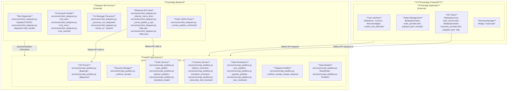

# Unnamed CodeViz Diagram

```mermaid
graph TD

    subgraph base.cv::prontoapp_frontend["**\\*\\*ProntoApp Frontend\\*\\***<br>[External]"]
        subgraph base.cv::prontoapp_frontend_app["**ProntoApp Application**<br>[External]"]
            base.cv::prontoapp_frontend_app_ui["**User Interface**<br>lib/features `screens`, lib/core/widgets `custom_text_field.dart`"]
            base.cv::prontoapp_frontend_app_state_management["**State Management**<br>lib/data/providers `order_provider.dart`, pubspec.yaml `provider`"]
            base.cv::prontoapp_frontend_app_api_client["**API Client**<br>lib/data/services `auth_service.dart`, lib/data/providers `inventory_provider.dart`, pubspec.yaml `http`"]
            base.cv::prontoapp_frontend_app_routing["**Routing Manager**<br>lib/app `routes.dart`"]
        end
    end
    subgraph base.cv::prontoapp_backend["**ProntoApp Backend**<br>[External]"]
        subgraph base.cv::prontoapp_backend_telegram_bot["**Telegram Bot Service**<br>[External]"]
            base.cv::prontoapp_backend_telegram_bot_dispatcher["**Bot Dispatcher**<br>services/src/bot_telegram.py `Updater(TOKEN)`, services/src/bot_telegram.py `dispatcher.add_handler`"]
            base.cv::prontoapp_backend_telegram_bot_command_handler["**Command Handler**<br>services/src/bot_telegram.py `cmd_start`, services/src/bot_telegram.py `cmd_menu`, services/src/bot_telegram.py `cmd_cancelar`"]
            base.cv::prontoapp_backend_telegram_bot_ai_processor["**AI Message Processor**<br>services/src/bot_telegram.py `_procesar_con_deepseek`, services/src/bot_telegram.py `cliente_ia = OpenAI`"]
            base.cv::prontoapp_backend_telegram_bot_api_client["**Backend API Client**<br>services/src/bot_telegram.py `_obtener_menu_texto`, services/src/bot_telegram.py `_enviar_pedido_a_api`, services/src/bot_telegram.py `httpx.get`, services/src/bot_telegram.py `httpx.post`"]
            base.cv::prontoapp_backend_telegram_bot_order_parser["**Order JSON Parser**<br>services/src/bot_telegram.py `_extraer_pedido_confirmado`"]
        end
        subgraph base.cv::prontoapp_backend_api["**FastAPI Web Service**<br>services/src/api_pedidos.py `app = FastAPI()`, services/requirements_bot.txt `fastapi`"]
            base.cv::prontoapp_backend_api_router["**API Router**<br>services/src/api_pedidos.py `@app.get`, services/src/api_pedidos.py `@app.post`"]
            base.cv::prontoapp_backend_api_security_manager["**Security Manager**<br>services/src/api_pedidos.py `_verificar_secreto`"]
            base.cv::prontoapp_backend_api_order_service["**Order Service**<br>services/src/api_pedidos.py `crear_pedido`, services/src/api_pedidos.py `obtener_pedidos`, services/src/api_pedidos.py `actualizar_estado`"]
            base.cv::prontoapp_backend_api_inventory_service["**Inventory Service**<br>services/src/api_pedidos.py `obtener_inventario`, services/src/api_pedidos.py `actualizar_inventario`, services/src/api_pedidos.py `_descontar_del_inventario`"]
            base.cv::prontoapp_backend_api_data_persistence["**Data Persistence**<br>services/src/api_pedidos.py `_leer_pedidos`, services/src/api_pedidos.py `_guardar_pedidos`, services/src/api_pedidos.py `_leer_inventario`"]
            base.cv::prontoapp_backend_api_telegram_notifier["**Telegram Notifier**<br>services/src/api_pedidos.py `_notificar_cambio_estado_telegram`"]
            base.cv::prontoapp_backend_api_data_models["**Data Models**<br>services/src/api_pedidos.py `BaseModel`, services/src/api_pedidos.py `PedidoIn`"]
        end
        %% Edges at this level (grouped by source)
        base.cv::prontoapp_backend_telegram_bot["**Telegram Bot Service**<br>[External]"] -->|"Queries/Updates information"| base.cv::prontoapp_backend_api["**FastAPI Web Service**<br>services/src/api_pedidos.py `app = FastAPI()`, services/requirements_bot.txt `fastapi`"]
        base.cv::prontoapp_backend_telegram_bot_api_client["**Backend API Client**<br>services/src/bot_telegram.py `_obtener_menu_texto`, services/src/bot_telegram.py `_enviar_pedido_a_api`, services/src/bot_telegram.py `httpx.get`, services/src/bot_telegram.py `httpx.post`"] -->|"Makes API calls to"| base.cv::prontoapp_backend_api["**FastAPI Web Service**<br>services/src/api_pedidos.py `app = FastAPI()`, services/requirements_bot.txt `fastapi`"]
        base.cv::prontoapp_backend_telegram_bot_api_client["**Backend API Client**<br>services/src/bot_telegram.py `_obtener_menu_texto`, services/src/bot_telegram.py `_enviar_pedido_a_api`, services/src/bot_telegram.py `httpx.get`, services/src/bot_telegram.py `httpx.post`"] -->|"Makes API calls to"| base.cv::prontoapp_backend_api_router["**API Router**<br>services/src/api_pedidos.py `@app.get`, services/src/api_pedidos.py `@app.post`"]
    end
    %% Edges at this level (grouped by source)
    base.cv::prontoapp_frontend_app["**ProntoApp Application**<br>[External]"] -->|"Makes API requests"| base.cv::prontoapp_backend_api["**FastAPI Web Service**<br>services/src/api_pedidos.py `app = FastAPI()`, services/requirements_bot.txt `fastapi`"]
    base.cv::prontoapp_frontend_app_api_client["**API Client**<br>lib/data/services `auth_service.dart`, lib/data/providers `inventory_provider.dart`, pubspec.yaml `http`"] -->|"Makes API requests to"| base.cv::prontoapp_backend_api["**FastAPI Web Service**<br>services/src/api_pedidos.py `app = FastAPI()`, services/requirements_bot.txt `fastapi`"]

```
---
*Generated by [CodeViz.ai](https://codeviz.ai) on 5/11/2026, 6:55:01 PM*
